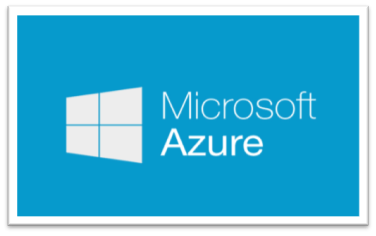
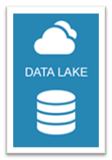

# Connect Tableau to the DataLake Platform on Windows

###### Version 1.0.0.0

## I. About this document

In this tutorial, you'll learn how to connect and use PowerBI with the DataLake Platform hosted on Azure Cloud. All the tools and configurations screens are available for a Windows Desktop 32 and 64 bits.

---