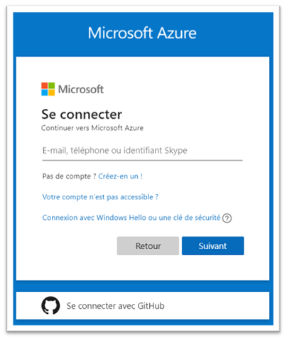
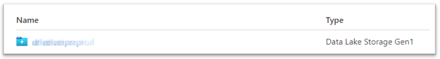
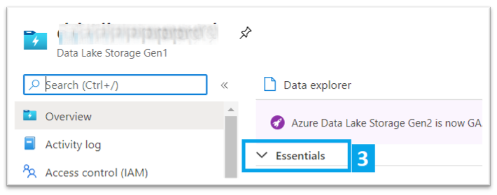
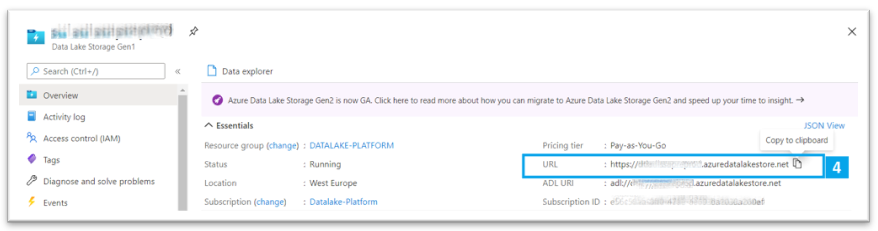

## III. Go to the Azure Portal to get ADLS informations

First of all, you’ll need to know the URL/URI of your Azure DataLake storage to access from PowerBI.

##### 1. Go to <https://portal.azure.com/>

##### 2. Login

##### 3. find and go to the Azure DataLake Storage Resource you want to access with PowerBI

Then click "Essentials" 

##### 4. Copy the URL

---