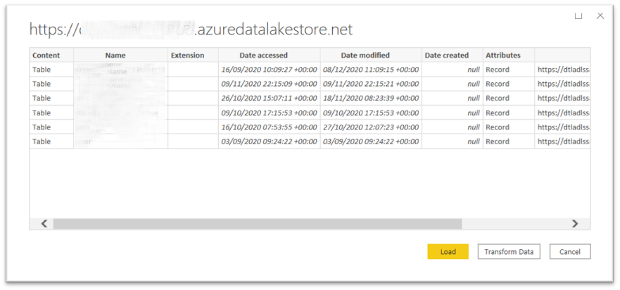

### Step 1. Connect PowerBI to ADLS 

##### 1. Click "Get data"

##### 2. Type "azure" and select "Azure Data Lake Storage Gen1"

Then **Connect**

##### 3. Copy the URL (III. 4)

Then click **OK**

##### 4. View Data Lake Storage content

You can see the Data Lake Storage content as like you are in the Azure Portal Data Explorer

---