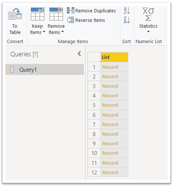

### Step 2. Access and visualize data

##### 1. Click "Transform Data"

##### 2. Navigate to a unique DataSource

Click "Table" to enter directory

##### 3. Unique Data Source are indicated by "Binary Type"

Click **Binary** to access to the data content

##### 4. Convert to Table to visualize content

Then **OK**

##### 5. Extend the table

Then **OK**

Then you can visualize and exploit the DataSource

---