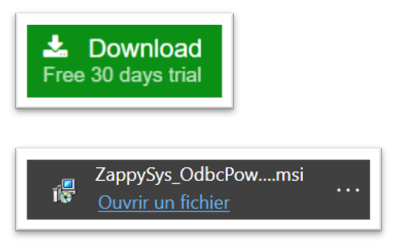
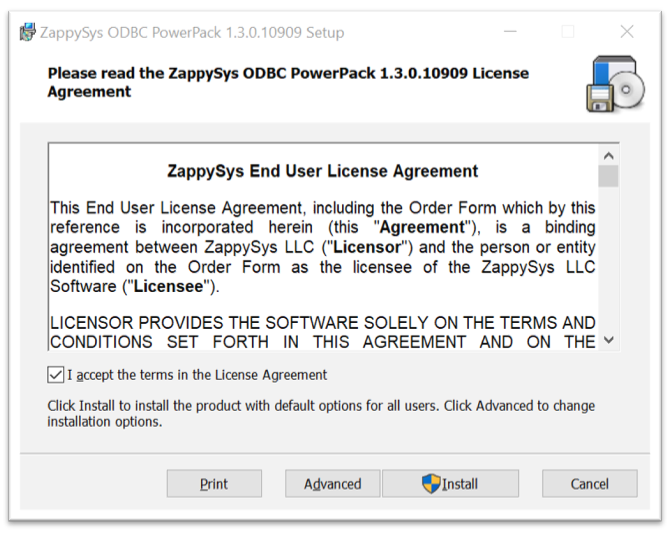
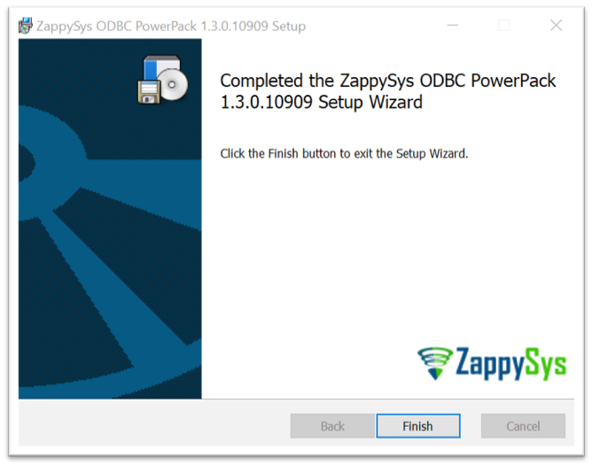
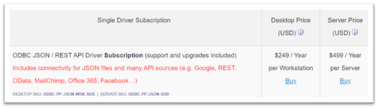

## III. Download and install ODBC JSON Driver

First of all, you’ll need an ODBC JSON / REST API Driver
For example, we’ll use the driver proposed by [ZappySys] and included in their ODBC PowerPack

##### 1. Go to <https://zappysys.com/products/odbc-powerpack/>

##### 2. Download the ODBC PowerPack

##### 3. Open the .msi file, accept the terms and the Install (You’ll need Admin rights)

##### 4. Click Finish and close the Install Window

##### 5. For information, the License is free for 30 days, then here are prices

For more informations, go to <https://zappysys.com/products/odbc-powerpack/purchase/>

---

[ZappySys]: https://zappysys.com/