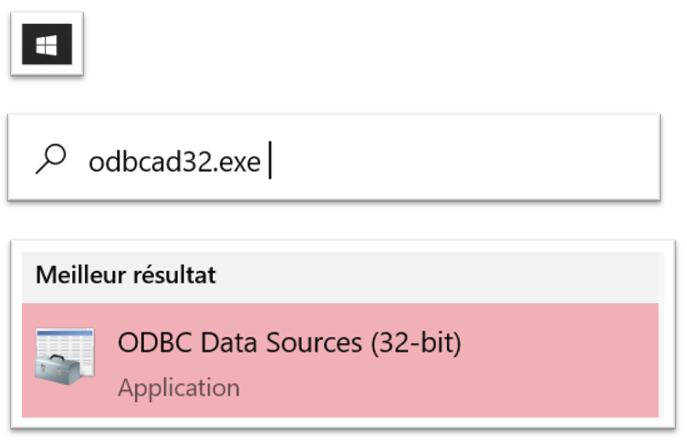
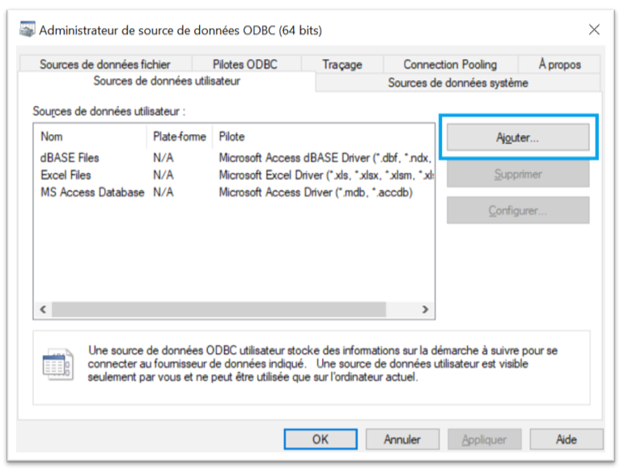
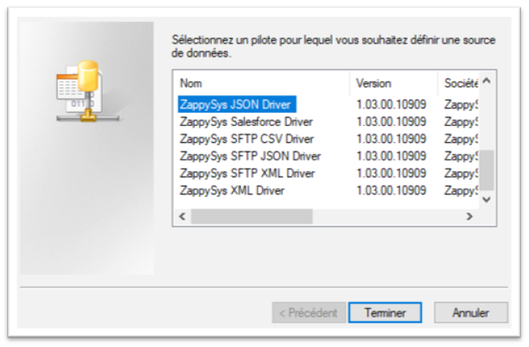
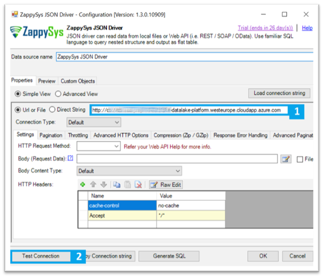
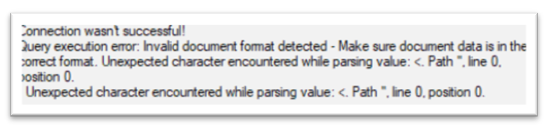

## IV. Configure and test ODBC JSON Driver

##### 1. Type « odbcad32.exe » in your search box and launch the DSN Config utility.

Don’t worry with the CPU config 32 or 64, the utility will use the preferred version

##### 2. Add a new Data Source and select “JSON Driver”

##### 3. Configure and test connection with API server

We’ll check if the connection with the DataLake Platform through API calls is possible

1. Just set the **Azure Endpoint** in the URL field prefixed with http or https (depends of your context and configuration)
2. Click “Test Connection”

If you got this kind of message, the connection is possible, we can go to the next step and configure and use API calls in PowerBI

***/!\ But if you got a Timeout error or Hostname does not exist or is unresolved, check your configuration, network flows and your firewall rules***

---