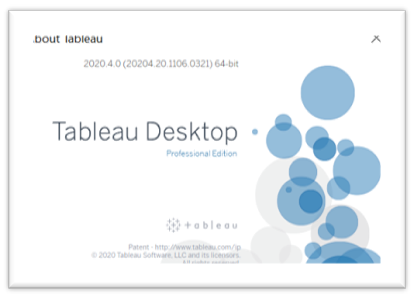

## II. Prerequisites

##### 1. Windows

##### 2. Tableau – Here is the version we use for this tutorial

##### 3. You’ll need to know the Azure Endpoint of the DataLake Platform

For example: **your_azure_domain.cloudapp.azure.com**

---