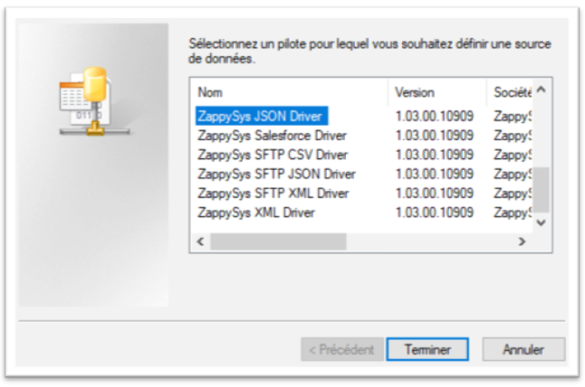
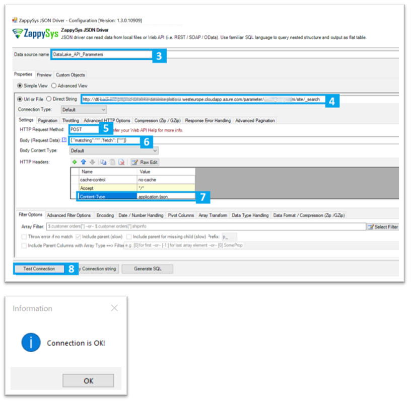

## V. Request DataLake Parameters API

Tableau use the ODBC JSON Driver to communicate with the DataLake. You’ll need to create a Datasource in order to generate a query interpretable by Tableau

### Step 1. ODBC JSON DataSource

##### 1. Create a new ODBC JSON DataSource

##### 2. Here is the configuration to set and adapt with your context

	curl --location --request POST 'http://[AZURE ENDPOINT]/parameter/[PARTNER_CODE]/site/_search' \
	--header 'Content-Type: application/json' \
	--data-raw '{
	"matching":"*",
	"fetch": ["*"]
	}'

##### 3. Name the DataSource: DataLake_API_Parameters (important to find it easily in PowerBI)

##### 4. Set the Request URL: http://[AZURE ENDPOINT].cloudapp.azure.com/parameter/[PARTNER CODE]/site/_search

##### 5. Set the HTTP method: POST

##### 6. Set the Body: {"matching":"*","fetch": ["*"]}

##### 7. Add Content-Type Header, with value : application/json

##### 8. Test connection

----