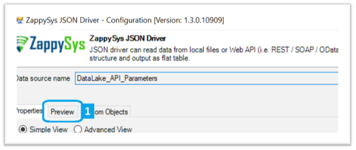
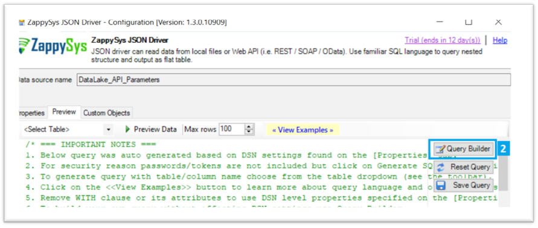
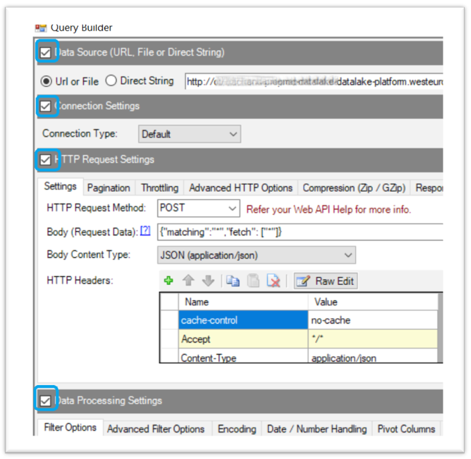
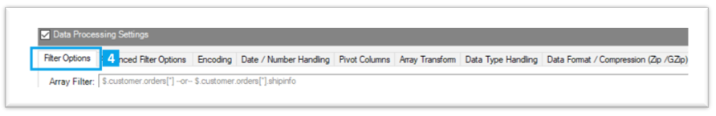
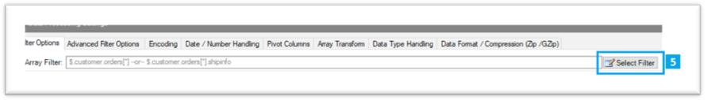
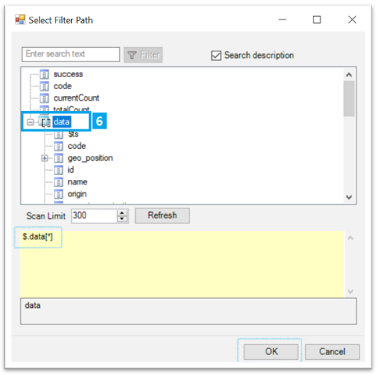
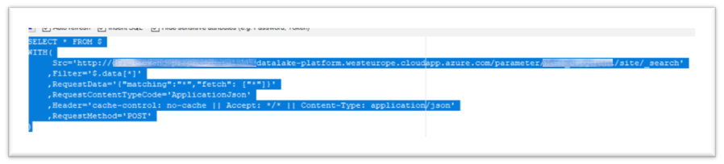

### Step 2. Extract the ODBC JSON Query

/!\ Very important: Tableau only accept the generic Driver ODBC JSON and a custom query to declare and use DataSource.
We'll need to generate and convert the ODBC JSON JDataSource created in Step 1 into a query interpretable by Tableau

##### 1. In the ODBC Datasource (Zappysys), go to Preview sheet



##### 2. Then “Query Builder”



##### 3. Extend the new window and select all the checkbox



##### 4. Go to “Filter Options” and extend the window if necessary



##### 5. Select Filter



##### 6. Select the “data” row, and validate



##### 7. Select and copy the query in the bottom of the screen – Late you’ll need to paste it in Tableau



Here is the query (Example) to copy

```
SELECT * FROM $
WITH(
	 Src='http://[AZURE ENDPOINT].westeurope.cloudapp.azure.com/parameter/[PARTNER CODE]/site/_search'
	,Filter='$.data[*]'
	,RequestData='{"matching":"*","fetch": ["*"]}'
	,RequestContentTypeCode='ApplicationJson'
	,Header='cache-control: no-cache || Accept: */* || Content-Type: application/json'
	,RequestMethod='POST'
)
```

---