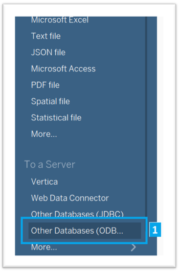
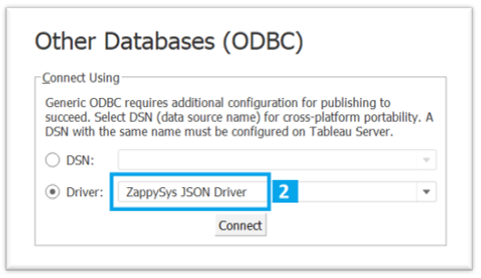
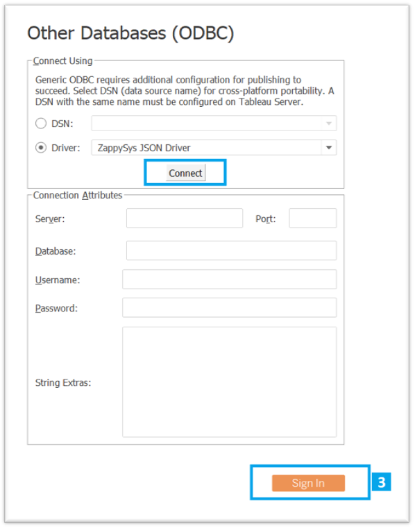
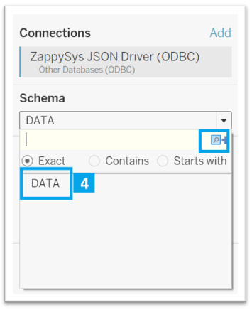
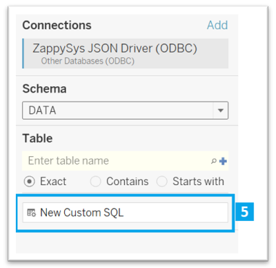
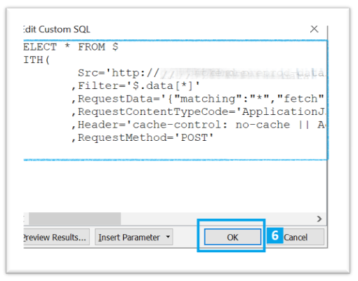
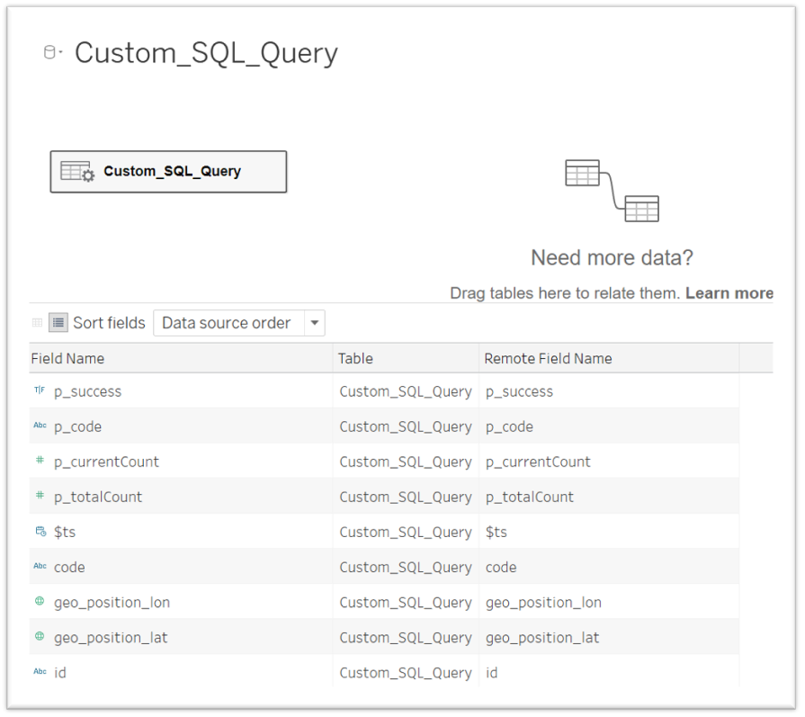

### Step 3. Go to Tableau and declare the Query for requesting Parameters

##### 1. Create a new ODBC Connection - Other Database (ODBC)

##### 2. Select your JSON ODBC Driver

##### 3. Click Connect and then Sign In

##### 4. Select Schema DATA

##### 5. New Custom SQL

##### 6. Copy the request (Step 2 .7)

Then we can visualize and use the differents fields of the DataSource

---