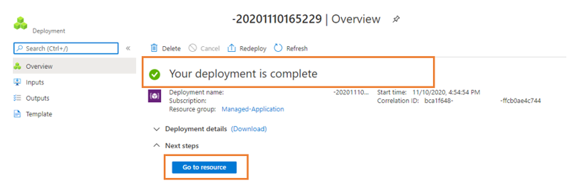
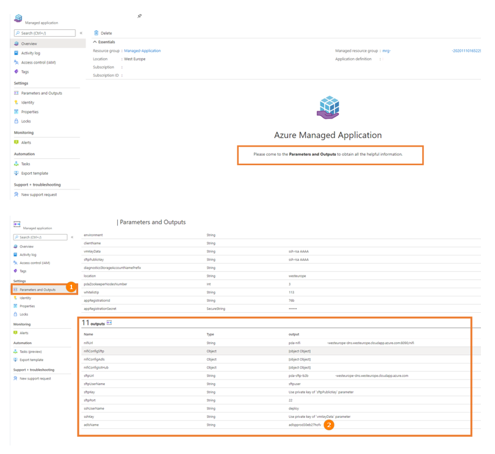
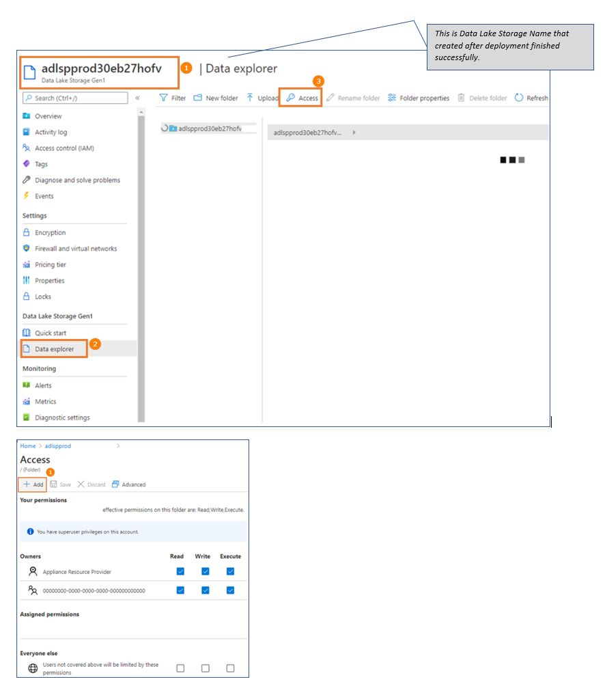
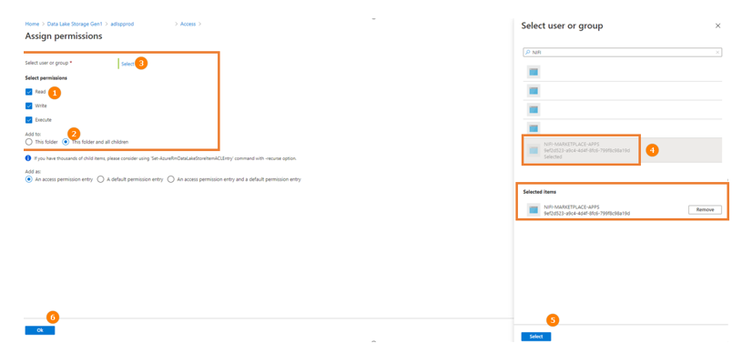
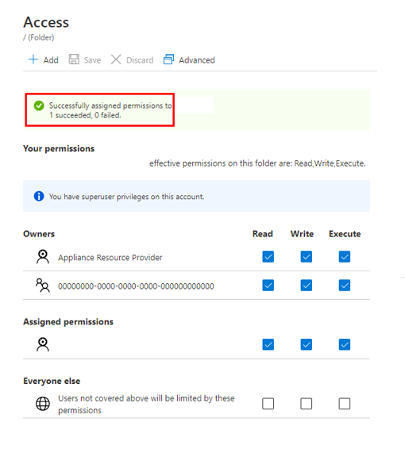

## III. Verify

Successfully deployment screen and confirm Outputs

***/!\ One more step: Grant access for “NIFI-MARKETPLACE-APPS” to your Data Lake Storage***

Config on Data Lake Storage:

Confirm this screen:

---
